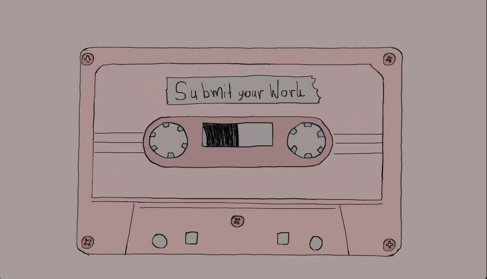

# Work at A*STAR

_I was here as a Temp Research Assistant and do some NLP stuff_ 

Things That I did at A*STAR:

* Learn Kaldi via [Jonathan Hui articles](https://jonathan-hui.medium.com/speech-recognition-series-71fd6784551a) on medium  
* Learn more Kaldi by [Eleanor Chodroff](https://www.eleanorchodroff.com/tutorial/kaldi/) tutorials
* Learn more Kaldi still by practicing on [UoEdinburgh](http://www.inf.ed.ac.uk/teaching/courses/asr/2019-20/lab6.pdf) labs
* [Crawl Vietnamese Text](https://github.com/TheMarvelousWhale/Vietnamese_text_dataset) for language models 
* Train my first [Vietnamese ASR](./Assets/atuan_script.png) using mfcc
* Train the second [Vietnamese ASR](./Assets/bill_script.png) on ivector (ongoing)
* Test Semantic Similarity Score on John Hopkins BERT model 
* Questions generation for Chatbot (ongoing)
* Punctuation prediction for ASR post-processing (ongoing)

My Notes:

1. [Vietnamese ASR](./ASRVIETSHARINGNOTES.html)
2. [Vietnamese Text](./Vietnamese_Text.md)
3. [ML Notes](./ML_study_notes.md)