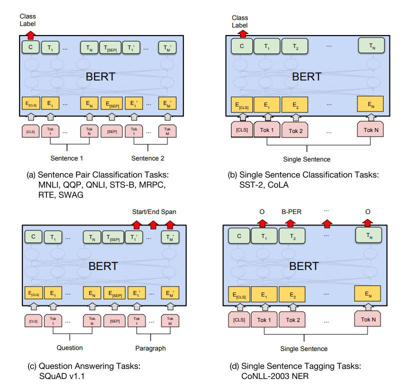

# Literature Review for Chatbot

_It gonna be terse. I don't like to ramble_ 

## Avaialble models for NLP Tasks

The big brothers are
* BERT
* GPT-2
* XLNET
* T5 the multitasker

The rest are too big for any reproducible effects. 

The tasks are 
* Semantic Similarity (STS), also known by Sentence Pair Classification
* Single Sentence -- similar to Sentiments Analysis
* Question Answering: given a paragraph, answer: answerable questions (closed form) and open-set questions (open form)
* Single Sentence Tagging -- similar to NER 


The dataset for each task is detailed in [Test Set](./Test_sets.md) Page. 


## Around-the-world Builts

For STS, John Hopkins have [this STS](https://github.com/AndriyMulyar/semantic-text-similarity). It runs on torch, cuda compiled or not does not matter. 89% on web, 85% on clinical (medical data). It is Bert > Pool > Dropout > Dense > Linear (0-5)

The issue with using STS for chatbot is well explained by sBert
```
However, it requires that both sentences are fed into the network, 
which causes a massive computational overhead.
Finding the most similar pair in a collection of 10,000 sentences 
requires about 50 million inference computations (~65 hours) with BERT. 
The construction of BERT makes it unsuitable for semantic similarity search 
as well as for unsupervised tasks like clustering.
```

For Intent Detection and Slot Filling, the current best performing model is from [Tencent](https://github.com/LeePleased/StackPropagation-SLU). The paper can be found [here](https://arxiv.org/pdf/1909.02188.pdf). The pointers to take note from this paper are
* Multi-Task (parallel) vs Stack Propagation (serial: downstream task benefit explicitly from upstream task)
* Token Level Intent Detection
* Bert in SLU

For sBert, please google the website. It is a vectorized embedding for BERT. 
