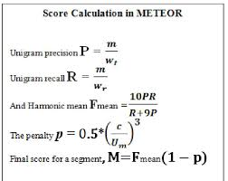

# NLP Metrics 

### _The basic:_
Cosine Sim: measure similarity in latent space. Useful for embeddings sim. 
Precision: #True Pos / # classified pos. Out of all the positive classified, how many are true. Impt for things like biometrics. 
Recall: #True Pos / (#true positive + #false negative). Out of all the true, how many did we predict true. Indicative of false negatives. 
F1: 2*precision*recall/(precision+recall). A mix of both. Or just to penalize precision with #false_neg. 

### _The industry standards:_

BLEU score: originated from MLT task. 0-1. Using overlapped n-grams to measure the accuracy of translated output to human reference. Prone to brevity, so it has a modified brevity penalty. 

Rogue: important for summarization and MLT. ROUGE-N measures n-gram overlaps. ROUGE-S is for skip bigrams. Rouge-L is for LCS

METEOR: came about because of bleu. Closer to segment. 

NIST: is essentially weighted BLEU, on rarer n-grams with higer weights. 

WER: important for ASR system. #SDI/#N (Levehnstein edit)

### _The string sim:_
Levehnstein: number of edits. Can be normalized over the length of sentence. 

Damerau-Levehnstein: transposition of adjacent characters only. 
JaroWrinkler: best fit for short strings.

LCS: longest common subsequence. A subsequence is a sequence that appears in the same relative order, but not necessarily contiguous. For example, “abc”, “abg”, “bdf”, “aeg”, ‘”acefg”, .. etc are subsequences of “abcdefg”.  Need use DP to calculate, and used in Git and Linux's diff. 

Q_gram: Q-gram distance, as defined by Ukkonen in ["Approximate string-matching with q-grams and maximal matches"](http://www.sciencedirect.com/science/article/pii/0304397592901434) The distance between two strings is defined as the L1 norm of the difference of their profiles (the number of occurences of each n-gram): SUM( |V1_i - V2_i| ). Q-gram distance is a lower bound on Levenshtein distance, but can be computed in O(m + n), where Levenshtein requires O(m.n). 

Jaccard: the cardinality of each n-gram is not taken into 

Fuzzy Match: [here](https://chairnerd.seatgeek.com/fuzzywuzzy-fuzzy-string-matching-in-python/)

_CD task_

LRAP: [here](https://stackoverflow.com/questions/55881642/how-to-interpret-label-ranking-average-precision-score)