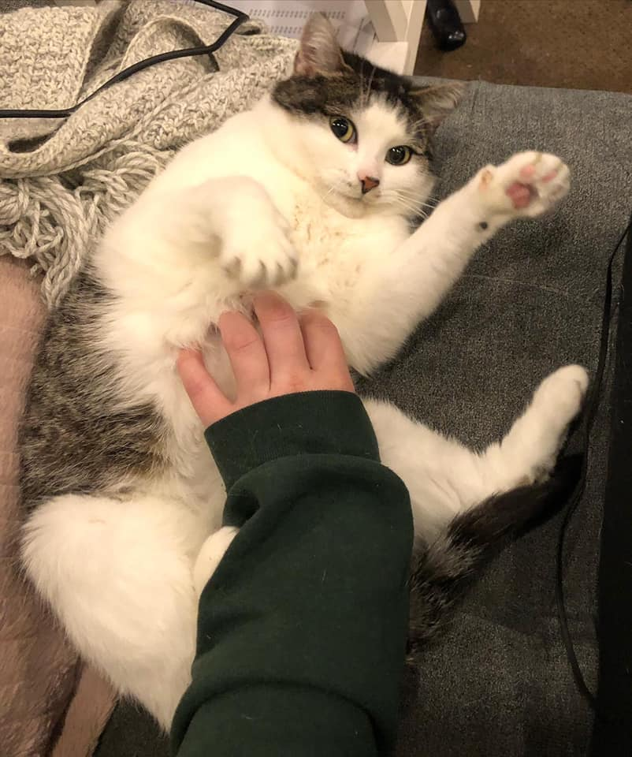

## Sosig learns to Spik 

_Yes it is the same Sosig Catto (pronounced: '[sɒsɪʤz](https://www.google.com/search?client=firefox-b-d&q=sausage+ipa+pronunciation)') that provides the answers for the NTU4069 Malware Analysis Cohort_

This page is where I maintain a comprehensive, single-endpoint for all of my NLP journey. It acts as a journal, literature review, updates keeping, a code practice playground, previous work done at the companies I've worked with as well as host my FYP (because I want to yeet everything in one place). 

## **Menu for today**
1. [Interviews I have had](./RiceBowl/main.md)
2. [NLP Interview Qns Prep](./NLP_interview_qns_vol1.md)
3. [My Final Year Project@NTU](./FYP/main.md)

## Support my patreon

Sosig needs a coffee :>

